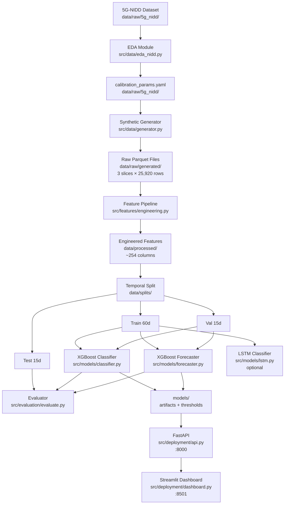
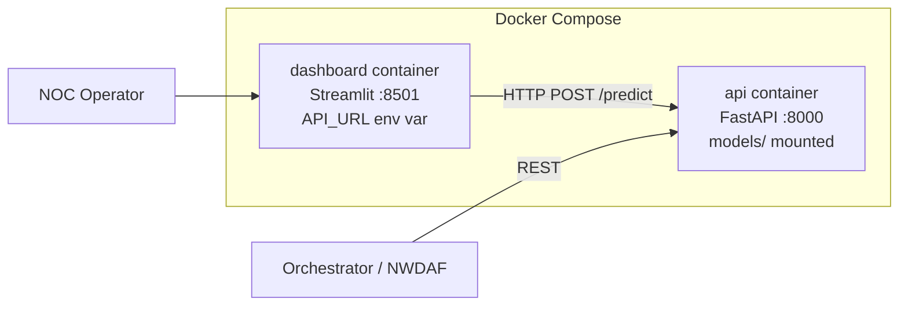

# Design Document: 5G QoS Predictor

## Overview

The 5G QoS Predictor is an end-to-end ML pipeline that predicts SLA violations in 5G network slices (eMBB, URLLC, mMTC) 15–60 minutes before they occur. It is modeled after the 3GPP NWDAF QoS Sustainability analytics ID (TS 23.288 §6.9).

The system follows a strict sequential pipeline:

```
5G-NIDD Dataset → EDA/Calibration → Synthetic Generator → Feature Engineering
    → Temporal Split → XGBoost Classifier + Forecaster (+ optional LSTM)
    → 8-Pillar Evaluation → FastAPI REST API → Streamlit Dashboard → Docker
```

Key design decisions:
- Synthetic data calibrated from real 5G-NIDD measurements ensures realistic KPI distributions without privacy concerns.
- Strict temporal partitioning (no random splits) prevents data leakage in time-series evaluation.
- AUC-PR is the primary metric (not AUC-ROC) because the positive class rate is ~3–5%.
- SHAP TreeExplainer provides per-prediction explanations for operator trust.
- All intermediate datasets are stored as Parquet for efficient columnar I/O.

---

## Architecture

### System-Level Data Flow



### Deployment Architecture



---

## Components and Interfaces

### 1. EDA Module (`src/data/eda_nidd.py`)

Reads 5G-NIDD Argus flow records via the existing `ArgusFlowLoader`, computes per-KPI statistics, and writes `calibration_params.yaml`.

**Key functions:**

```python
def run_eda(data_dir: Path) -> dict:
    """Load 5G-NIDD, compute calibration params, save YAML, save plots."""

def compute_kpi_stats(series: pd.Series, kpi_name: str) -> dict:
    """Fit distribution, return {distribution, mean, std, min, max, range}."""

def compute_correlations(df: pd.DataFrame) -> pd.DataFrame:
    """Pearson correlation matrix across all KPI columns."""

def compute_mobility_variance(df: pd.DataFrame) -> dict:
    """Per-scenario (vehicular, pedestrian, static) variance per KPI."""

def save_calibration_params(params: dict, path: Path) -> None:
    """Write structured YAML importable by the generator."""

def save_plots(df: pd.DataFrame, figures_dir: Path) -> None:
    """Time-series overview + per-KPI distribution histograms."""
```

**Output:** `data/raw/5g_nidd/calibration_params.yaml` (already partially exists), plots in `reports/figures/`.

---

### 2. Synthetic Generator (`src/data/generator.py`)

Produces 90 days × 288 intervals/day = 25,920 rows per slice. All KPI distribution parameters are loaded from `calibration_params.yaml` — none are hardcoded.

**Key functions:**

```python
def generate_slice_data(
    slice_type: str,          # 'eMBB', 'URLLC', 'mMTC'
    days: int = 90,
    inject_violations: bool = True,
    seed: int = 42,
) -> pd.DataFrame:
    """Top-level entry point. Returns DataFrame with all KPIs + targets."""

def build_load_profile(slice_type: str, n_timesteps: int) -> np.ndarray:
    """Layer 1+2: intraday pattern × weekly modulation × daily jitter."""

def derive_kpis_from_load(
    load: np.ndarray,
    slice_type: str,
    calibration: dict,
) -> pd.DataFrame:
    """Layer 3: physical KPI relationships from load level."""

def apply_autocorrelated_noise(
    kpi_series: np.ndarray,
    kpi_name: str,
    calibration: dict,
    alpha: float = 0.3,
) -> np.ndarray:
    """Layer 4: temporally smoothed noise from calibrated distribution."""

def inject_events(
    df: pd.DataFrame,
    slice_type: str,
    event_schedule: list[dict],
) -> pd.DataFrame:
    """Layer 5: apply degradation ramps for each event type."""

def apply_cross_slice_coupling(
    embb_df: pd.DataFrame,
    urllc_df: pd.DataFrame,
    mmtc_df: pd.DataFrame,
) -> tuple[pd.DataFrame, pd.DataFrame, pd.DataFrame]:
    """Layer 6: PRB coupling penalty when total PRB > 90%."""

def build_targets(df: pd.DataFrame, slice_type: str) -> pd.DataFrame:
    """Compute any_breach, time_to_violation, violation_in_{15,30,60}min."""

def generate_all_slices(days: int = 90) -> dict[str, pd.DataFrame]:
    """Generate eMBB, URLLC, mMTC, apply cross-slice coupling, save Parquet."""
```

**Intraday load profiles:**

```python
# eMBB: triple-hump Gaussian (morning commute, lunch, evening streaming)
embb_load(t) = 0.15·exp(-((t-8.5)²)/(2·1.8²)) + 0.30·exp(-((t-12.5)²)/(2·1.5²))
             + 0.45·exp(-((t-20.5)²)/(2·2.2²)) + 0.08

# URLLC: sigmoid business-hours plateau
urllc_load(t) = sigmoid(3·(t-7.5)) - sigmoid(3·(t-17.5))

# mMTC: periodic impulse bursts (δ=1h, ε=0.1h duty cycle)
mmtc_load(t) = 0.15 + 0.7·(mod(t, δ) < ε)
```

**Event injection schedule (per event type):**

| Event Type | Affected Slices | Buildup Duration | Severity |
|---|---|---|---|
| traffic_surge | eMBB | 5 min | Uniform(0.3, 1.0) |
| gradual_congestion | eMBB, mMTC | 30–120 min | Uniform(0.3, 1.0) |
| interference | URLLC, eMBB | 0 min (instant) | Uniform(0.3, 1.0) |
| hw_degradation | All | 60–480 min | Uniform(0.3, 1.0) |
| resource_starvation | URLLC | 15–60 min | Uniform(0.3, 1.0) |
| iot_storm | mMTC | 0 min (instant) | Uniform(0.3, 1.0) |

**Degradation ramp formula:**
```
During buildup [t_buildup_start, t_event_start):
    degradation = severity × 0.7 × progress

During active window [t_event_start, t_event_end]:
    degradation = severity × Normal(1.0, 0.1)
```

**SLA thresholds used for target construction:**

| Slice | KPI | Threshold | Direction |
|---|---|---|---|
| eMBB | dl_throughput | 50 Mbps | min |
| eMBB | latency | 30 ms | max |
| eMBB | packet_loss | 1% | max |
| URLLC | latency | 5 ms | max |
| URLLC | reliability | 99.999% | min |
| URLLC | jitter | 1 ms | max |
| mMTC | delivery_rate | 95% | min |
| mMTC | latency | 1000 ms | max |

---

### 3. Feature Pipeline (`src/features/engineering.py`)

Transforms raw KPI time-series into ~254 features with strict no-lookahead guarantees. All operations use `shift()` and `rolling(min_periods=1)` only.

**Key functions:**

```python
def build_features(
    df: pd.DataFrame,
    slice_type: str,
    other_slices: dict[str, pd.DataFrame] | None = None,
) -> pd.DataFrame:
    """Orchestrates all 8 feature categories. Returns feature matrix."""

def add_lag_features(df: pd.DataFrame, kpi_cols: list[str]) -> pd.DataFrame:
    """Category 1: lags [1,3,6,12,24,36,72,144] → 56 features."""

def add_rolling_stats(df: pd.DataFrame, kpi_cols: list[str]) -> pd.DataFrame:
    """Category 2: windows [6,12,36,72,144,288] × {mean,std,range,cv} → 84 features."""

def add_ewma_features(df: pd.DataFrame, kpi_cols: list[str]) -> pd.DataFrame:
    """Category 3: spans [6,12,36] → 21 features."""

def add_rate_of_change(df: pd.DataFrame, kpi_cols: list[str]) -> pd.DataFrame:
    """Category 4: diff1, diff6, diff2, trend_sign → 35 features."""

def add_cyclical_time(df: pd.DataFrame) -> pd.DataFrame:
    """Category 5: hour_sin/cos, dow_sin/cos, is_weekend, etc. → 8 features."""

def add_sla_proximity(
    df: pd.DataFrame,
    slice_type: str,
    sla_thresholds: dict,
) -> pd.DataFrame:
    """Category 6: sla_margin, sla_margin_norm, rolling min margins,
       time_to_breach → ≥30 features."""

def add_cross_kpi_features(df: pd.DataFrame, slice_type: str) -> pd.DataFrame:
    """Category 7: BDP, spectral_eff, eff_throughput, jitter_ratio,
       bdp_diff → 5 features (eMBB only)."""

def add_cross_slice_features(
    df: pd.DataFrame,
    slice_type: str,
    other_slices: dict[str, pd.DataFrame],
) -> pd.DataFrame:
    """Category 8: competitor PRB, total PRB, rolling PRB means,
       active users/devices → 12 features."""
```

**Feature count summary:**

| Category | Features |
|---|---|
| 1. Temporal lags | 56 (7 KPIs × 8 lags) |
| 2. Rolling statistics | 84 (7 KPIs × 6 windows × 4 stats) |
| 3. EWMA | 21 (7 KPIs × 3 spans) |
| 4. Rate of change | 35 (7 KPIs × 5 features) |
| 5. Cyclical time | 8 |
| 6. SLA proximity | ≥30 |
| 7. Cross-KPI (eMBB) | 5 |
| 8. Cross-slice | 12 |
| **Total** | **≥251 (target ~254)** |

---

### 4. Temporal Split

```python
def temporal_split(df: pd.DataFrame) -> tuple[pd.DataFrame, pd.DataFrame, pd.DataFrame]:
    """
    Partition by calendar day:
      train: days 1–60
      val:   days 61–75
      test:  days 76–90
    Asserts no timestamp overlap between any two splits.
    """
```

Splits are stored as Parquet under `data/splits/{slice_type}_{train|val|test}.parquet`.

---

### 5. XGBoost Classifier (`src/models/classifier.py`)

One model per `(slice_type, horizon)` — 9 models total (3 slices × 3 horizons).

**Key functions:**

```python
def train_classifier(
    X_train: pd.DataFrame,
    y_train: pd.Series,
    X_val: pd.DataFrame,
    y_val: pd.Series,
    slice_type: str,
    horizon: int,
) -> XGBClassifier:
    """Train with scale_pos_weight, aucpr eval metric, early stopping."""

def find_optimal_threshold(
    clf: XGBClassifier,
    X_val: pd.DataFrame,
    y_val: pd.Series,
    min_recall: float = 0.90,
) -> float:
    """Highest-precision threshold achieving recall ≥ 0.90 on val set.
    Falls back to 0.5 if no threshold meets the recall constraint."""

def save_classifier(
    clf: XGBClassifier,
    threshold: float,
    slice_type: str,
    horizon: int,
    models_dir: Path,
) -> None:
    """Save model + threshold as {slice_type}_clf_{horizon}min.json + .threshold."""

def load_classifier(
    slice_type: str,
    horizon: int,
    models_dir: Path,
) -> tuple[XGBClassifier, float]:
    """Load model and its optimal threshold."""
```

**XGBoost hyperparameters:**

```python
{
    'n_estimators': 500,
    'max_depth': 6,
    'learning_rate': 0.05,
    'subsample': 0.8,
    'colsample_bytree': 0.8,
    'reg_alpha': 0.1,
    'reg_lambda': 1.0,
    'eval_metric': 'aucpr',
    'early_stopping_rounds': 20,
    'scale_pos_weight': neg_count / pos_count,  # ~19–30
}
```

---

### 6. XGBoost Forecaster (`src/models/forecaster.py`)

One model per `(slice_type, kpi, horizon)` — up to 63 models (3 slices × 7 KPIs × 3 horizons).

**Key functions:**

```python
def train_forecaster(
    X_train: pd.DataFrame,
    y_train: pd.Series,
    X_val: pd.DataFrame,
    y_val: pd.Series,
    slice_type: str,
    kpi: str,
    horizon_steps: int,
) -> XGBRegressor:
    """Regression target: df[kpi].shift(-h). Early stopping on RMSE."""

def evaluate_forecaster(
    model: XGBRegressor,
    X_test: pd.DataFrame,
    y_test: pd.Series,
) -> dict:
    """Returns {mae, rmse, mape}."""
```

---

### 7. LSTM Classifier (`src/models/lstm.py`)

Optional PyTorch sequence classifier. Uses the last 24 timesteps (2 hours) as input.

**Architecture:**

```
Input: (batch, seq_len=24, n_features)
  → LSTM(hidden=128, layers=2, dropout=0.2)
  → last hidden state (batch, 128)
  → Linear(128→64) → ReLU
  → Linear(64→32) → ReLU
  → Linear(32→1) → Sigmoid
Output: (batch,) violation probability
```

**Key class:**

```python
class SLAViolationLSTM(nn.Module):
    def __init__(self, input_size: int, hidden_size: int = 128,
                 num_layers: int = 2, dropout: float = 0.2): ...
    def forward(self, x: torch.Tensor) -> torch.Tensor: ...

class SLASequenceDataset(Dataset):
    """Sliding window dataset. seq_len=24, stride=1.
    Preserves temporal order — no shuffling."""
```

---

### 8. Evaluator (`src/evaluation/evaluate.py`)

Implements all 8 evaluation pillars in sequence. Pillar 1 (temporal integrity) must pass before any other pillar runs.

**Key functions:**

```python
def run_evaluation(
    clf: XGBClassifier,
    threshold: float,
    X_test: pd.DataFrame,
    y_test: pd.Series,
    test_df: pd.DataFrame,
    slice_type: str,
    horizon: int,
) -> dict:
    """Orchestrates all 8 pillars. Returns nested results dict."""

# Pillar 1
def verify_temporal_integrity(train, val, test) -> None: ...

# Pillar 2
def compute_classification_metrics(y_test, y_pred, y_proba) -> dict: ...

# Pillar 3
def compute_per_slice_metrics(results_by_slice: dict) -> dict: ...

# Pillar 4
def compute_per_event_recall(y_test, y_pred, event_types: pd.Series) -> dict: ...

# Pillar 5
def compute_horizon_f1(results_by_horizon: dict) -> dict: ...

# Pillar 6
def compute_lead_time_stats(y_pred, y_test, time_to_violation: pd.Series) -> dict: ...

# Pillar 7
def compute_shap_importance(clf, X_test, figures_dir: Path) -> np.ndarray: ...

# Pillar 8
def compute_baseline_comparison(X_test, y_test, sla_thresholds: dict) -> dict: ...
```

---

### 9. FastAPI (`src/deployment/api.py`)

**Endpoints:**

| Method | Path | Description |
|---|---|---|
| POST | `/predict` | Full prediction: probabilities, forecasts, SHAP, recommendations |
| GET | `/health/{slice_type}` | Current health status for a slice |
| GET | `/slices` | List of supported slice types |

**Request/Response models:**

```python
class KPIHistory(BaseModel):
    slice_type: str                    # 'eMBB', 'URLLC', 'mMTC'
    timestamps: list[str]              # ISO-8601, minimum 12 entries
    kpi_values: dict[str, list[float]] # kpi_name → values

class PredictionResponse(BaseModel):
    slice_type: str
    violation_probability: dict[str, float]   # {'15min', '30min', '60min'}
    forecasted_kpis: dict[str, dict[str, float]]
    top_risk_factors: list[dict[str, float]]  # top-5 SHAP feature-value pairs
    recommendations: list[str]
    health_status: str                         # 'healthy'|'warning'|'critical'
```

**Health status derivation:**
```
P(30min) < 0.30  → "healthy"
P(30min) ∈ [0.30, 0.70] → "warning"
P(30min) > 0.70  → "critical"
```

**Validation:** Requests with fewer than 12 timesteps return HTTP 422.
**Unknown slice_type:** Returns HTTP 404.

**Startup:** All 9 classifier models + 9 optimal thresholds are loaded into memory at startup. Forecaster models are loaded on demand per KPI.

---

### 10. Streamlit Dashboard (`src/deployment/dashboard.py`)

Six pages, each calling the FastAPI `/predict` endpoint or reading pre-computed evaluation results.

| Page | Key Components |
|---|---|
| Slice Overview | Risk gauges (green/yellow/red), KPI delta indicators, 3-slice side-by-side |
| Real-time Monitoring | KPI time-series with SLA threshold lines overlaid |
| Violation Prediction | Probability timeline + KPI values + actual violations |
| Model Performance | Confusion matrices, per-event recall, lead time distribution |
| Batch Analysis | CSV upload → backtesting via API |
| Feature Importance | SHAP summary bar plots + individual waterfall explanations |

---

## Data Models

### Raw KPI Row (per slice, per 5-minute interval)

```python
@dataclass
class KPIRow:
    timestamp: datetime
    slice_type: str           # 'eMBB' | 'URLLC' | 'mMTC'
    # KPIs (7 columns)
    dl_throughput: float      # Mbps
    latency: float            # ms
    jitter: float             # ms
    packet_loss: float        # %
    prb_util: float           # 0–1
    active_users: float       # count
    reliability: float        # %
    # Event label
    event_type: str           # 'normal' | one of 6 event types
    # Targets
    any_breach: bool
    time_to_violation: float  # minutes, sentinel=9999 when no violation imminent
    violation_in_15min: int   # 0 or 1
    violation_in_30min: int   # 0 or 1
    violation_in_60min: int   # 0 or 1
```

### Engineered Feature Row

The feature matrix has ~254 columns (all numeric, float32) plus `timestamp`, `slice_type`, `event_type`, and the three target columns. No target columns are included in the feature matrix `X`.

### Model Artifact Layout

```
models/
├── embb_clf_15min.json          # XGBoost classifier
├── embb_clf_15min.threshold     # float, optimal decision threshold
├── embb_clf_30min.json
├── embb_clf_30min.threshold
├── embb_clf_60min.json
├── embb_clf_60min.threshold
├── urllc_clf_{15,30,60}min.*    # same pattern
├── mmtc_clf_{15,30,60}min.*
├── embb_fcst_dl_throughput_15min.json   # XGBoost forecaster
├── ...                                  # one per (slice, kpi, horizon)
└── lstm_embb_30min.pt           # optional LSTM checkpoint
```

### Calibration Parameters Schema

```yaml
# data/raw/5g_nidd/calibration_params.yaml
dl_throughput:
  distribution: lognormal
  mean: float
  std: float
  range: [min, max]
latency:
  distribution: gamma
  mean: float
  std: float
  range: [min, max]
# ... one entry per KPI
```

### Temporal Split Files

```
data/splits/
├── embb_train.parquet
├── embb_val.parquet
├── embb_test.parquet
├── urllc_{train,val,test}.parquet
└── mmtc_{train,val,test}.parquet
```

---

## Correctness Properties

*A property is a characteristic or behavior that should hold true across all valid executions of a system — essentially, a formal statement about what the system should do. Properties serve as the bridge between human-readable specifications and machine-verifiable correctness guarantees.*

